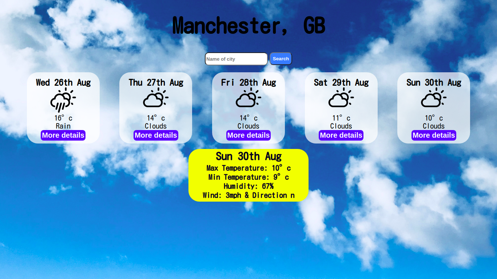
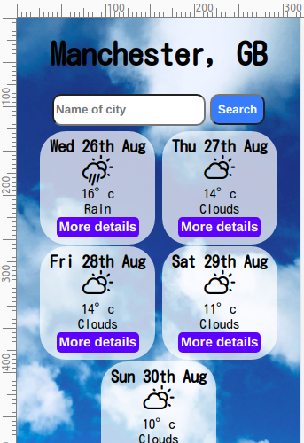

# Weather Forecast App (React)

The actual app has been deployed [here](https://weather-app-2.vercel.app/) using [Vercel](https://vercel.com/).

## The app

This project was part of the Manchester Codes (@MCRcodes) curriculum.

It uses a weather API which contains the weather data from cities across the UK.

The form lets you search for the city which you want the weather information of. If you type an invalid city name, the app will alert you that the city does not exist.

This app was built using React. The design is mobile-friendly and responsive to adapt to different screen sizes.




Testing utilities used:

- [Jest](https://jestjs.io/)
- [React Testing Library](https://testing-library.com/docs/react-testing-library/intro)

Packages used:

- [Axios](https://www.npmjs.com/package/axios)
- [PropTypes](https://www.npmjs.com/package/prop-types)
- [React Icons Library](https://react-icons.github.io/react-icons/)

## How to run the app

Clone the repo onto your machine.

```
$ git clone https://github.com/ari-anha/React-tech-test
```

Change directories so that you are in the cloned repository.

```
$ cd React-tech-test
```

Install npm.

```
$ npm i
```

Start npm.

```
$ npm start
```

The app should pop up onto your browser.

## Created by Arianha Bayley
